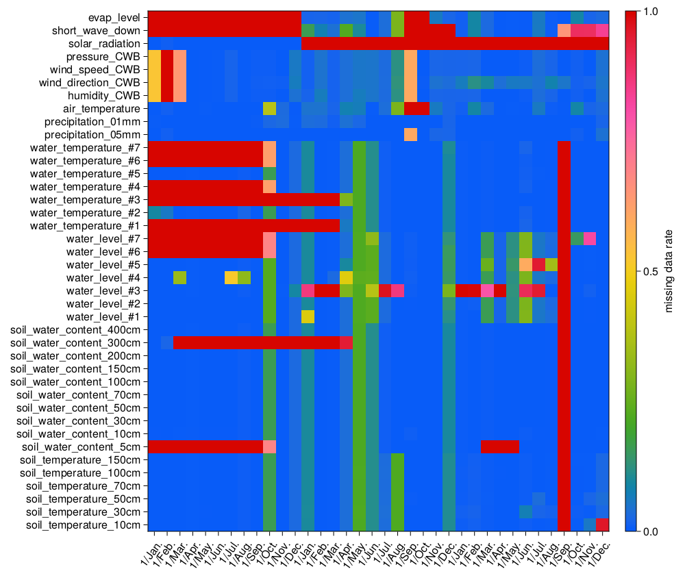

# Making of the dataset `TowerNCU_combined`

````julia
using DataFrames
using CSV
using Revise, SmallDatasetMaker, SWCDatasets, OkFiles
````

## Load the tables

````julia
fpaths = filelistall(r"TowerNCU_Li", SWCDatasets.dir_raw())
dfs = CSV.read.(fpaths, DataFrame)
basename.(fpaths)
````

````
3-element Vector{String}:
 "TowerNCU_Li-Data2018_0623.csv"
 "TowerNCU_Li-Data2019_0531.csv"
 "TowerNCU_Li-Data2020_0801.csv"
````

## Table differences ignoring `soil_water_`

````julia
dft = difftables(dfs...; ignoring = Cols(r"soil_water_"))
````

````
3×4 DataFrame
 Row │ nrow   ncol   cols_lack           cols_add
     │ Int64  Int64  Array…              Array…
─────┼───────────────────────────────────────────────────────────────────
   1 │ 52560     33  Symbol[]            Symbol[]
   2 │ 52560     34  [:solar_radiation]  [:short_wave_down, :evap_level]
   3 │ 52704     34  [:solar_radiation]  [:short_wave_down, :evap_level]
````

## Remove extra soil water contents

````julia
select!.(dfs, [Not(Cols(r"soil_water_content_\D+"))]) # Delete e.g., soil_water_content_#2...
select!.(dfs, [Not(Cols(r"soil_water_content_\d+\_"))]) # Delete e.g., soil_water_content_2...
dft = difftables(dfs...)
````

````
3×4 DataFrame
 Row │ nrow   ncol   cols_lack           cols_add
     │ Int64  Int64  Array…              Array…
─────┼───────────────────────────────────────────────────────────────────
   1 │ 52560     43  Symbol[]            Symbol[]
   2 │ 52560     44  [:solar_radiation]  [:short_wave_down, :evap_level]
   3 │ 52704     44  [:solar_radiation]  [:short_wave_down, :evap_level]
````

## Concatenate tables

````julia
df_all = DataFrame()
for df in dfs
    append!(df_all, df; cols = :union)
end
````

## Dataoverview

````julia
using CairoMakie, SWCForecastBase, Dates
ismln(x) = islnan(x) || ismissing(x)
DR = DataRatio(df_all, Month(1), islnan)
f = Figure(;resolution=(1000,850))
ax = Axis(f[1, 1]; xticklabelrotation = 0.3π)
hmap = heatmap!(ax, DR; colormap = "diverging_rainbow_bgymr_45_85_c67_n256")
Colorbar(f[1, 2], hmap, label = "missing data rate")
f
````


## Save the dataset
```
dir_temp = SWCDatasets.dir_raw("NCUWiseLab", "TowerNCU_combined.csv")
CSV.write(dir_temp, df_all)
SD = SourceData(dir_temp)
compress_save!(SWCDatasets, SD)
```

## (Literate)


````
"TowerNCU"
````

Literate.markdown(SWCDatasets.dir_docs("scripts", scriptfile), SWCDatasets.dir_docs(outputfoldername); config = Dict("execute" => true), documenter=false)

---

*This page was generated using [Literate.jl](https://github.com/fredrikekre/Literate.jl).*

